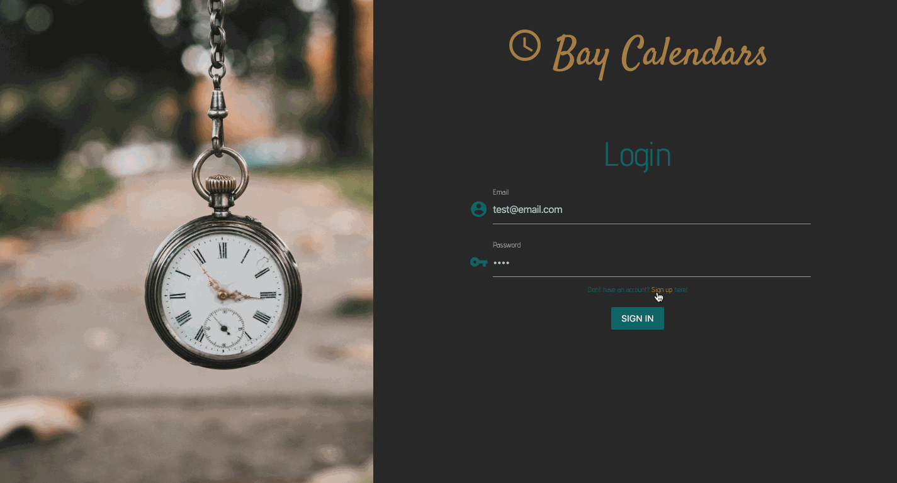

# Bay Calendars

### Overview

Timeframe : < 2 weeks

This is a full-stack application that allows users to schedule events on their calendars and invite other users to those events. This app comes with all of the functionality you could imagine. From user authentication to sending out invites to your friends to accept via email, this is a great tool for anyone trying to stay organized and wants a user-friendly experience.

### Technology Used
* HTML5
* Materialize
* Handlebars
* jQuery
* Node
* Express
* MySQL
* Passport
* Nodemailer
* Moment

### Developers
* [Emily Coraccio](https://github.com/emcoraccio)
* [Michael Nos](https://github.com/mmnos)
* [Nik Arbodela](https://github.com/AmericanNik)
* [Keith Naber](https://github.com/kpoole133)
* [Kenneth Poole](https://github.com/knaber4124)

### Deployed Here : https://secure-taiga-47401.herokuapp.com/

### Want to give it a try? Sign in with the test account below.
Email : test@email.com

Password : test